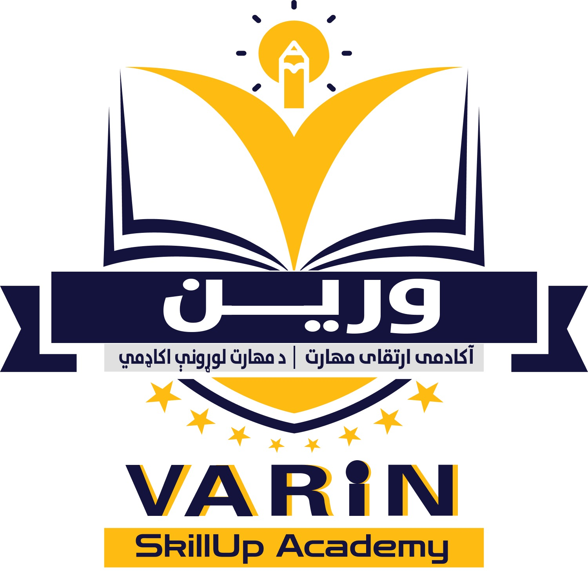

## Varin SkillUp Academy – School Website (Laravel)

Production-ready Laravel app for an education and training academy site with SEO, news, gallery, contact, and certificate verification features.

- **Live demo**: [`https://varinacademy.com/`](https://varinacademy.com/)

### Preview



| Home | Banner | Gallery |
| --- | --- | --- |
|  |  |  |

> Images are stored under `public/assets/images` and optimized via Vite/Tailwind in the frontend.

## Features

- **Public Pages**
  - Home, About, Courses, News listing and details, Gallery, Contact, Verify Certificate
  - Clean header/navigation and responsive design with Tailwind CSS
  - Floating WhatsApp contact button

- **News & Content**
  - News listing (`/news`) and SEO-friendly detail pages (`/news/{slug}`)
  - `Post` model with `published_at`, title, slug, excerpt, content, image

- **Gallery**
  - Static gallery page with lightweight script and lazy-loaded images

- **Contact**
  - Contact form (`/contact`) that emails `resources/views/emails/contact.blade.php`

- **Certificate Verification**
  - Public verification page (`/certificate/verify`)
  - Search, view by ID, and QR generation for certificates
  - Admin can create certificates; public can validate authenticity

- **Admin Area** (auth-protected)
  - Dashboard, Profile management
  - CRUD for Posts, Users, Certificates
  - Settings screen (basic site settings)

- **SEO & Social Sharing**
  - Centralized meta via `App\\Services\\SeoService`
  - Title, description, keywords, canonical
  - Open Graph and Twitter Card tags
  - Organization JSON-LD schema

- **Sitemaps**
  - Index: `/sitemap.xml`
  - Pages: `/sitemap-pages.xml` (home, about, courses, news index, gallery, contact, verify certificate, HTML sitemap, login, optional register)
  - News: `/sitemap-news.xml` (published news articles)
  - Human-friendly HTML sitemap: `/sitemap`

- **Branding & Assets**
  - Favicons, PWA manifest, and academy logo in `public/assets/images`
  - Social links in the footer (Facebook, YouTube, LinkedIn)

## Tech Stack

- Laravel 11, PHP 8+
- Blade, Tailwind CSS, Vite
- SQLite (default) or MySQL/PostgreSQL

## Getting Started

1) Clone and install

```bash
git clone <repo-url> school-website
cd school-website
composer install
npm install
```

2) Environment

```bash
cp .env.example .env
php artisan key:generate
```

Update `.env` for your mail and database settings (SQLite works out of the box with `database/database.sqlite`).

3) Database

```bash
php artisan migrate --seed
```

4) Build assets and run

```bash
npm run build   # or: npm run dev
php artisan serve
```

Visit `http://127.0.0.1:8000`.

## Notable Routes

- Public: `/`, `/about`, `/courses`, `/news`, `/news/{slug}`, `/gallery`, `/contact`
- Verify Certificate: `/certificate/verify`, `/certificate/verify/{id}`, `/certificate/search`
- Auth: `/login` (+ optional `/register` if enabled)
- Dashboard: `/dashboard`
- Sitemaps: `/sitemap`, `/sitemap.xml`, `/sitemap-pages.xml`, `/sitemap-news.xml`

## Project Structure Highlights

- Controllers in `app/Http/Controllers` (including `SitemapController`, `ContactController`)
- Models in `app/Models` (`Post`, `Certificate`, `Setting`, `User`)
- SEO utilities in `app/Services/SeoService.php`
- Views in `resources/views` (layouts, pages, components, emails)
- Assets under `public/assets/images`

## Screenshots / Assets

- Logo: `public/assets/images/logo.jpeg`
- Hero/Preview: `public/assets/images/1.jpg`, `public/assets/images/3.jpg`, `public/assets/images/4.jpg`
- Banners: `public/assets/images/banners/banner-*.jpeg`

## License

MIT

## Credits

- Varin SkillUp Academy content and branding. Live instance: [`https://varinacademy.com/`](https://varinacademy.com/)
